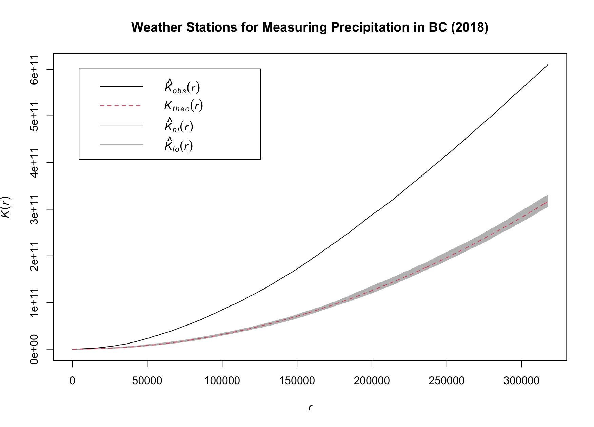
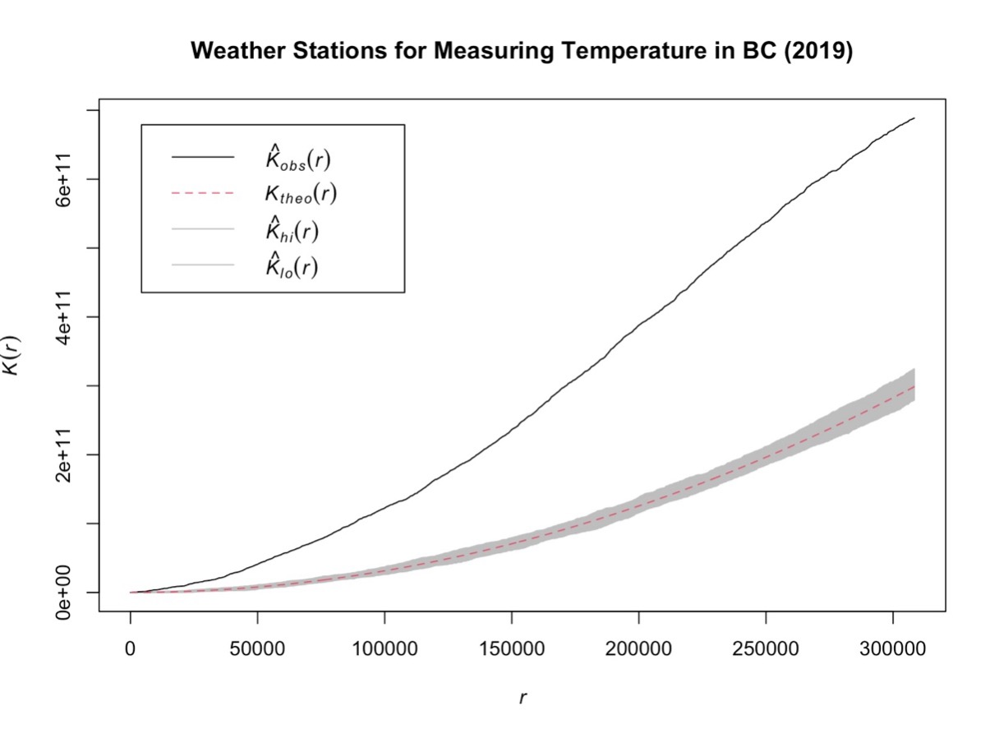
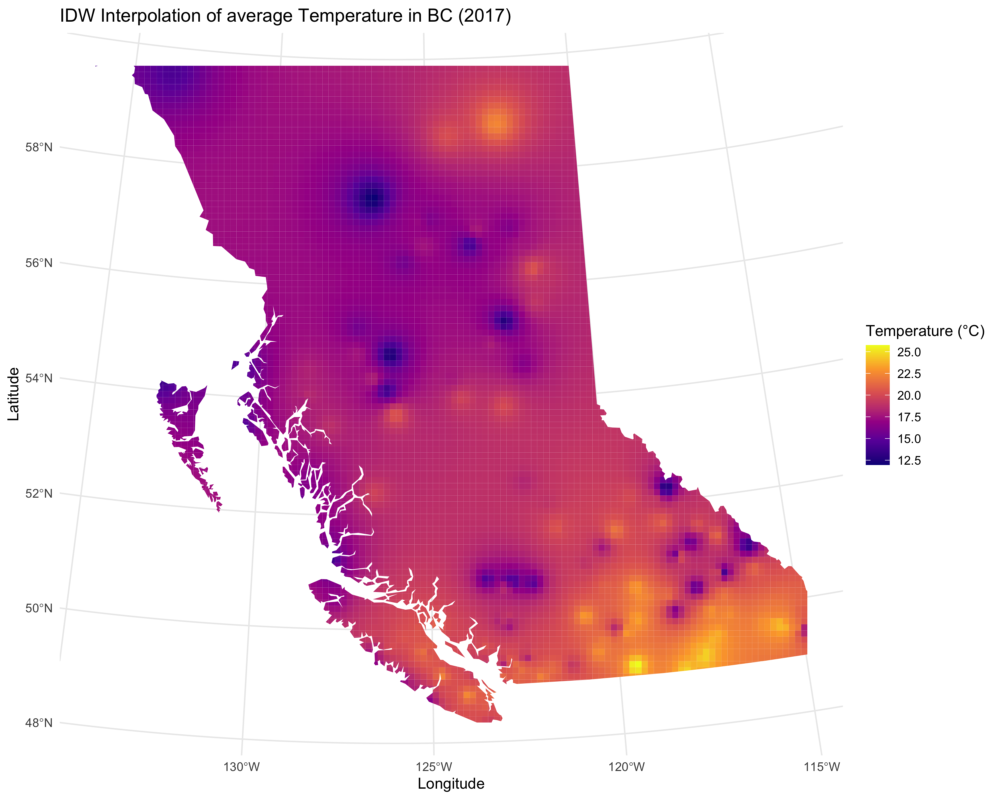
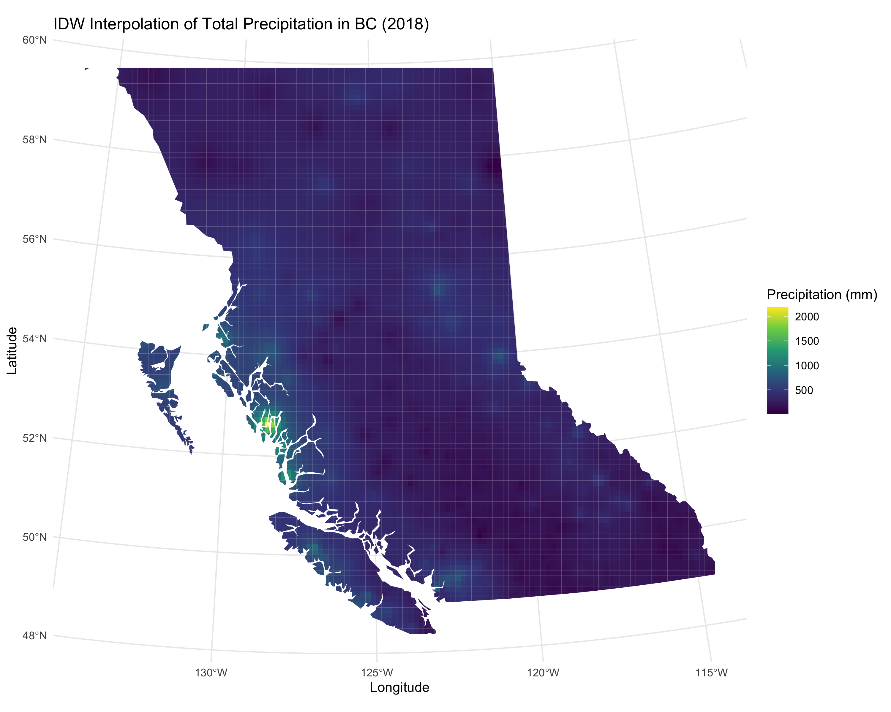
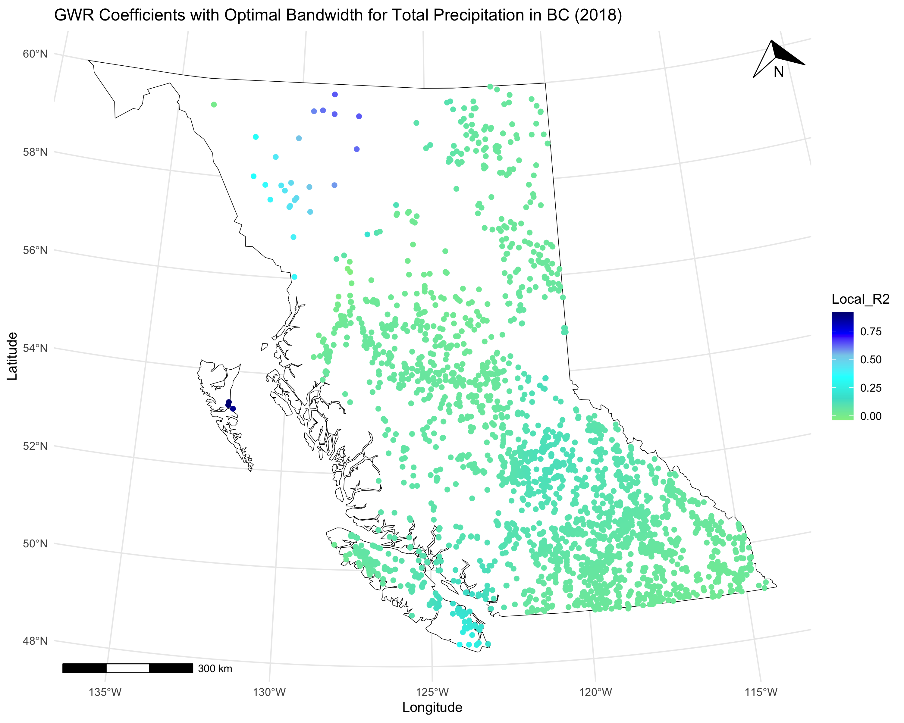
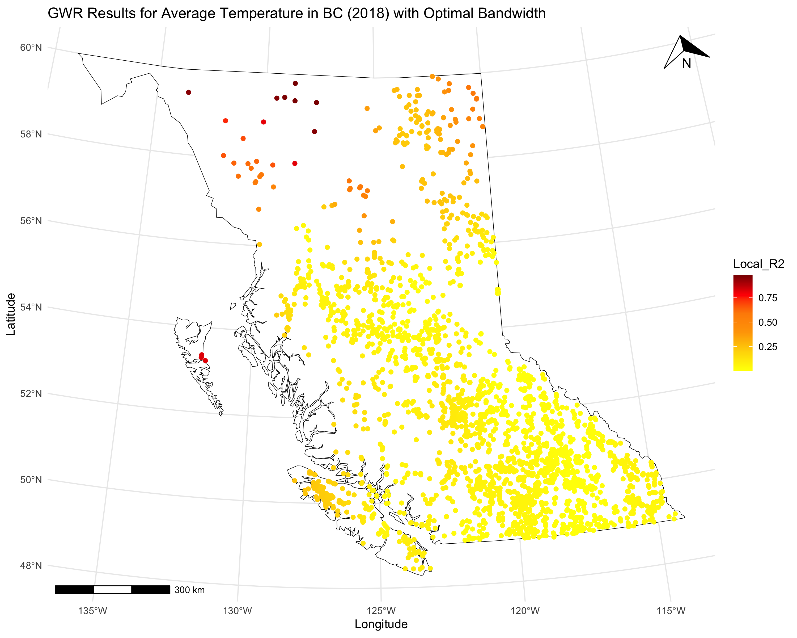
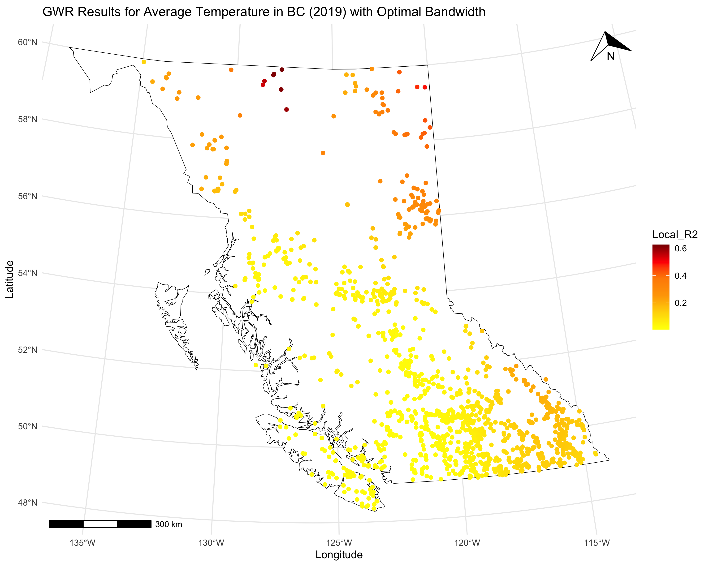

# Climate_Impact_Analysis 1
## test sizes 2
### size 3
#### size 4
##### size 5

### 1.0 Introduction

Over the past few decades, wildfires have burned millions of hectares of forest across British Columbia (BC), devastating the landscape. Notably, the four most severe wildfire seasons occurred in 2017, 2018, 2021, and 2023 (Parisien et al., 2023). Wildfires significantly impact ecosystems, including biodiversity, habitats, water systems, and human settlements (Haider et al., 2019). Additionally, the smoke from these fires severely affects air quality over vast distances (Douglas-Vail et al., 2023).
BC's complex topography encompasses diverse ecosystems and climates, characterized by variations in elevation, temperature, and vegetation. These environmental differences lead to significant spatial variations in wildfire intensity and extent (Meyn et al., 2013). Examining environmental factors at a spatial resolution that reflects this diversity is crucial to avoid obscuring these variations (Meyn et al., 2013). However, wildfire prediction and management remain challenging due to limited understanding of wildfires' roles in the Earth's system (Liu et al., 2024).

In BC, the area burned by wildfires appears to depend more strongly on precipitation than temperature (Meyn et al., 2013). Since precipitation patterns are inherently difficult to predict, projecting changes in wildfire severity in BC introduces greater uncertainties compared to regions where temperature is the primary limiting factor (Meyn et al., 2013). Therefore, it is vital to analyze fire-climate relationships at high spatial resolutions to capture variability in precipitation and temperature and their effects on wildfire extent (Meyn et al., 2013). Understanding whether temperature or precipitation plays a more significant role in wildfire severity is key to improving predictions and management strategies in BC (Meyn et al., 2013).

The wildfire seasons of 2017 and 2018 were among the worst in recent decades, with 1,216,053 hectares and 1,354,284 hectares burned, respectively. In stark contrast, 2019 saw a 98% decrease in burned area, with only 21,138 hectares affected. This raises the question: what made 2019 so different from the preceding two years?
This study seeks to deepen the understanding of the relationship between wildfires and climate by examining differences in climate conditions during 2017, 2018, and 2019. The goal is to determine whether temperature or precipitation played a greater role in the significant reduction of wildfire activity in 2019.

### 2.0 Study Area and Data

The study area for this research is British Columbia (BC), Canada, located between 48° and 60°N latitude and spanning 944,735 km² (Figure 4). BC is renowned for its diverse ecosystems, which range from coastal rainforests and alpine tundra to boreal forests and temperate grasslands. This ecological diversity is driven by significant variations in elevation, temperature, precipitation, soil type, and geographic location.

The coastal rainforests, situated along BC’s Pacific coastline, experience abundant precipitation, particularly during the winter months, and enjoy mild temperatures year-round. Winters typically range from 5 to 10°C, while summers vary between 15 and 20°C. The alpine tundra, found at higher elevations, is characterized by cold temperatures year-round, with low precipitation that primarily falls as snow. The boreal forests, prevalent in northern BC, receive moderate precipitation throughout the year, with cool summers and harsh winters that can dip to −40°C. In contrast, the temperate grasslands, located in interior regions such as the Okanagan Valley, receive low precipitation (mostly in spring), experience cold winters, and endure very hot summers, with temperatures often exceeding 35°C. These ecosystems reflect the complexity of BC's topography and climate, which play a critical role in shaping wildfire activity across the region.

This study utilizes secondary data obtained from two primary sources. The Fire data was collected from the BC Data Catalogue and includes the number of fires each year, the total area burned, and the geographic locations of the fires. Climate data was obtained from the Weather Station Data Portal and has the station name, elevation, location, total precipitation, average precipitation, and average temperature for each data point. Both fire and climate data are point data and were analyzed spatially and temporally to assess patterns and relationships.

One significant limitation of the climate data is the sparse distribution of weather stations across the study area. Only 200 to 400 weather stations provide data for a region as vast and topographically diverse as BC. This limited coverage introduces potential biases and gaps, particularly in remote or high-elevation regions where weather conditions can vary considerably over short distances.

The fire and climate datasets are essential to understanding the relationship between wildfires and climatic conditions. The fire data allows for spatial and temporal analysis of wildfire occurrences and their impact, while the climate data provides critical variables, such as precipitation and temperature, which influence wildfire behavior and intensity.

### 3.0 Methods

This study employs a range of spatial analysis methods to investigate the relationship between climate and wildfire activity in British Columbia (BC). The analysis includes examining the spatial distribution of weather stations and wildfires, as well as assessing spatial autocorrelation within each dataset. These methods are crucial for identifying patterns and dependencies in the spatial arrangement of data points.

To better understand climatic variability across BC, weather station data for temperature and precipitation were interpolated into continuous surfaces. This visualization enables a clearer representation of climate changes across the province’s diverse topography.

Finally, regression analyses were conducted to explore how temperature and precipitation influence the amount, severity, and spatial distribution of wildfires. These analyses include both traditional regression models and geographical regression, which accounts for spatial variability in the relationship between climate and wildfire activity.
By integrating these methods, the study aims to provide a comprehensive understanding of the fire-climate relationship in BC, highlighting the roles of temperature and precipitation in wildfire disturbance.

<b>3.1	Evaluating the Spatial Distribution of Weather Stations</b>

To assess the spatial distribution of weather stations in British Columbia (BC), three methods were utilized: Nearest Neighbor Distance Analysis, Quadrat Analysis, and K-Function Analysis. Nearest Neighbor Distance Analysis identifies whether the distribution of weather stations is random, uniform, or clustered by calculating the average distance between each station and its closest neighbor. Quadrat Analysis divides the study area into a grid of equal-sized cells to examine the density and dispersion of stations, revealing local variations in their distribution. K-Function Analysis builds on the nearest neighbor approach by evaluating spatial patterns at multiple scales, offering a more detailed perspective on clustering or dispersion across different distances. Each method contributes unique insights into the spatial arrangement of weather stations.

<b>Nearest Neighbour Distance</b>

The Nearest Neighbor Distance (NND) analysis is a widely used method to assess the spatial distribution of points across a study area. It tests whether the points fall into one of three categories: clustered, dispersed, or random. Points are considered clustered when they occur near one another. In the case of complete clustering, all the points in the study area would overlap, resulting in a Nearest Neighbor Distance mean of zero. This is because when measuring the distance between any two points, the result would be zero, as they would occupy the same location.

In contrast, a dispersed distribution occurs when points are spread out across the area. The mean Nearest Neighbor Distance dispersion varies for each study area and must be calculated to determine what the dispersion would look like if the points were perfectly distributed. To calculate the expected dispersion for a study area, the density of points must first be computed by dividing the total number of points by the area of study. This density is then used to calculate a theoretical perfectly dispersed distribution across the study area (see formula below).

$$
\bar{NND_d} = \frac{1.07453}{\sqrt{\text{Density}}}
$$

To find the observed NND, the distance between each point and its nearest neighbor (the closest point) is measured (Clark & Evans, 1954). The sum of all these distances is then divided by the number of points in the study area, giving the average Nearest Neighbor Distance. The formula to compute the mean observed NND is shown below..

$$
\bar{NND} = \frac{\sum \text{NND}}{n}
$$

The mean nearest neighbor random distribution is a theoretical value that represents a random distribution unique to the given study area study area (Clark & Evans, 1954). This value is then compared to the observed NND. If the observed NND is smaller than the random value, it suggests clustering of points. If the observed NND is larger than the random value, it suggests a dispersed distribution. The formula to find the mean random NND for a given study area is shown below.

$$
\bar{\text{NND}_r} = \frac{1}{2\sqrt{\text{Density}}}
$$

To assess whether the observed distribution is significantly different from the theoretical random distribution, a z-score is calculated (see below equation). The z-score tests if the observed pattern deviates significantly from a random distribution, indicating whether the spatial arrangement of points is clustered, random, or dispersed.

$$
Z_n = \frac{\bar{\text{NND}} - \bar{\text{NND}_r}}{\sigma(\bar{\text{NND}})}
$$

<b>Quadrat Analysis</b>

Similar to the Nearest Neighbor Distance (NND) analysis, the Quadrat Analysis assesses the distribution of points across a given study area. It does this by overlaying a grid of equal-sized quadrats on the point data and calculating the number of points that fall within each quadrat (Thomas, 1977). This method helps determine if the spatial distribution of points is significantly different from a random spatial pattern.

The variation (VAR) between the quadrats is then calculated, as shown in the equation below. The VAR is used to indicate whether the points follow a clustered or dispersed distribution. A relatively high VAR suggests a clustered distribution, while a relatively low VAR indicates a dispersed distribution. However, the VAR alone cannot confirm if the distribution of points is significantly different from a theoretical random distribution for the given study area. To determine statistical significance, the VAR must be standardized, and a chi-square statistic must be computed.

$$
\text{VAR} = \frac{\sum f_i x_i^2 - \left( \frac{\left( \sum f_i x_i \right)^2}{m} \right)}{m - 1}
$$

To standardize the VAR for the study area, it is compared to the average number of points per quadrat. The mean is calculated by dividing the total number of points by the number of quadrats. The VAR is then divided by the mean to calculate the Variance-to-Mean Ratio (VMR). The formulas for VAR and VMR can be found below. If the distribution is perfectly random, the VAR and mean will be equal, resulting in a VMR of 1. For a clustered distribution, the VMR will be greater than 1, while for a dispersed distribution, the VMR will be less than 1.

To test if the findings are significantly different from a random distribution, the chi-square statistic and corresponding p-value are computed.

$$
\text{MEAN} = \frac{n}{m}
$$

$$
\text{VMR} = \frac{VAR}{MEAN}
$$

<b>K-Function Analysis</b>

The K-Function Analysis is used to evaluate the spatial distribution of points across a study area, determining whether the pattern is clustered, dispersed, or random. Unlike the Nearest Neighbor method, which examines the distribution of points only at the nearest level, the K-function provides a more detailed analysis by assessing the spatial arrangement at multiple distances. This capability allows the K-function to address the challenge of scale in spatial analysis, as it reveals how point patterns change at different distances from a given point, providing a more comprehensive view of spatial structure.

The K-function works by calculating a ratio, denoted as K(d), which represents the number of points within a specified distance (d) from a randomly selected point. This ratio is then compared to the expected density of points for a random distribution, referred to as Kcsr(d). The Kcsr(d) represents the theoretical number of points that would be expected to fall within the same distance in a randomly distributed pattern, and it serves as a baseline for comparison. The K-function is calculated using the formula shown below, where K(d) is derived from the observed number of points within distance d and compared to the expected number of points (Kcsr(d)) from a random distribution, as defined in the equation below.

$$
K(d) = \lambda^{-1} E(N_d)
$$

$$
K_{\text{CSR}}(d) = \pi d^2
$$

By comparing K(d) to Kcsr(d), the K-function provides insight into the spatial structure of the point pattern. If the observed K(d) is significantly greater than the expected Kcsr(d), it suggests a clustered pattern, where points are more concentrated around each other than would be expected by chance. Conversely, if K(d) is smaller than Kcsr(d), it suggests a dispersed pattern, where points are spread out more evenly than a random distribution would predict. When K(d) is close to Kcsr(d), it indicates a random distribution, where points are spatially independent and show no evident clustering or dispersion. The K-function, therefore, provides a robust statistical method for understanding the spatial arrangement of points at varying distances and offers critical insights into spatial relationships within the study area.

<b>3.2 Analyzing the Spatial Autocorrelation of Weather Stations</b>

<b>Global Moran’s I</b>

Global Moran’s I is a widely used spatial statistical method designed to assess spatial autocorrelation within a given study area. Spatial autocorrelation refers to the degree to which a value at one location is related to values at neighboring locations. In other words, it evaluates whether similar values tend to cluster in space or if dissimilar values are spatially grouped together. Global Moran’s I quantifies this spatial relationship by measuring the extent to which each location’s value deviates from the overall mean of the dataset and comparing these deviations to the deviations observed in its neighboring locations. This method extends the concept of the Pearson correlation coefficient, which measures the linear relationship between two variables, by adapting it to the spatial context (Westerholt, 2023).

The calculation of Global Moran’s I incorporates spatial weights, which are used to define the relationships between locations in the study area. These weights, represented as Wi,j in the formula below, reflect the proximity or connectivity between locations i and j, influencing how much the value at one location is affected by the value at its neighbor. By multiplying the deviations from the mean at location i (xi) and its neighbor j (xj) by the corresponding spatial weight Wi,j, Moran’s I accounts for the varying strengths of these spatial relationships. The denominator of the formula standardizes the result, ensuring the output is comparable across different study areas.

$$
I = \frac{\sum_{i=1}^n\sum_{j=1}^nW_{i,j}(x_i - \bar{x})(x_j - \bar{x})}{(\sum_{i=1}^n\sum_{j=1}^nW_{i,j})\sum_{i=1}^n(x_i - \bar{x})^2}
$$

The resulting value of Moran’s I provides insights into the nature of spatial autocorrelation in the dataset. Higher values of Moran’s I indicate strong positive spatial autocorrelation, meaning that similar values tend to cluster together in space. Conversely, lower values of Moran’s I suggest strong negative spatial autocorrelation, where dissimilar values are more likely to be found near each other. The method is particularly useful for identifying spatial patterns and determining the degree to which the arrangement of values is influenced by spatial proximity.

<b>3.3 Interpolating Temperature and Precipitation</b>

Interpolation methods estimate values at unsampled locations using observed data points, creating continuous surfaces that represent spatial patterns. In this study, Inverse Distance Weighting (IDW) and Kriging were employed to create interpolated surfaces of total precipitation and average temperature in British Columbia.

<b>Inverse Distance Weighting (IDW)</b>

IDW is a deterministic spatial interpolation method that assumes points closer to the location being estimated have more influence on the interpolated value than points farther away (Ibrahim & Nasser, 2017). It uses the exact observed values to generate a smooth surface, where gradual changes occur based on the spatial distribution of the data. The formula for IDW, shown in the equation below, calculates the interpolated value Z(x) as a weighted average of known values. Each observed value $$Z_i$$ is assigned a weight based on its distance from the estimation point, with closer points receiving higher weights. The weights decrease with increasing distance, and the result is normalized by dividing by the sum of all weights. Additionally, the power parameter in the IDW formula plays a critical role in controlling the surface smoothness, with higher power values emphasizing the influence of closer points more strongly (Ibrahim & Nasser, 2017). Importantly, IDW does not alter the observed data values used in the interpolation.

$$
Z_j = k_j \sum_{i=1}^n \left( \frac{1}{d_{ij}^a} \right) z_i
$$

<b>Kriging</b>

Kriging, on the other hand, is a geostatistical interpolation method that accounts for both the spatial autocorrelation and the distances between sampled points (Ibrahim & Nasser, 2017). Unlike IDW, Kriging not only provides interpolated values but also offers an estimate of prediction uncertainty. It uses a variogram to model spatial autocorrelation, which describes how the similarity between data points changes with distance (Ibrahim & Nasser, 2017). Based on this, weights are assigned to known points, optimized to minimize prediction error. The formula for Kriging, shown in the equation below, estimates the value at an unknown location as a weighted sum of known values. The weights are determined by solving a system of linear equations derived from the variogram model.

$$
Z(x) = \sum_{i=1}^{N} \lambda_i Z(x_i)
$$

In this study, Ordinary Kriging was applied, which assumes the mean of the data is unknown but constant across the study area. This method is particularly advantageous for accounting for spatial variability and providing robust estimates, especially in heterogeneous datasets. By combining deterministic and geostatistical methods, the interpolation surfaces generated in this study offer complementary insights into spatial patterns of precipitation and temperature.

<b>3.4	Determining the Influence of Temperature and Precipitation on Wildfire Disturbance</b>

To examine the relationship between temperature, precipitation, and wildfire disturbances in British Columbia, both regression analysis and geographical regression analysis were employed. These statistical methods allow for a detailed exploration of the extent to which climate variables influence the occurrence, intensity, and distribution of wildfires.

<b>Regression Analysis</b>

Regression analysis is a statistical method used to model and quantify the relationship between dependent and independent variables. In this study, the dependent variable represents wildfire disturbance metrics (e.g., area burned, fire severity, or frequency), while the independent variables are climate-related factors, including average temperature and total precipitation. The relationship between these variables can be expressed by a linear regression model show below.

$$
Y = \beta_0 + \beta_1 X_1 + \beta_2 X_2 + \epsilon
$$

This method assumes that the relationships between variables are consistent across the study area. The statistical significance of the regression coefficients is assessed using hypothesis tests, and the model’s overall fit is evaluated using metrics such as the $$R^2$$ value, which indicates the proportion of variance in the dependent variable explained by the independent variables.

When performing a linear regression analysis, it is essential to ensure that four key assumptions are met to validate the model and ensure it provides accurate predictions and inferences. Violations of these assumptions can compromise the reliability of the model's results (Poole & O’Farrell, 1971). These assumptions include linearity, which means that the relationship between the independent variables and the dependent variable should be linear (Poole & O’Farrell, 1971). Another critical assumption is constant variance, which requires that the errors, or residuals, have a consistent spread across all levels of the independent variables, a property known as homoscedasticity (Poole & O’Farrell, 1971). Additionally, the errors are expected to follow a normal distribution, where most errors are small and extreme values are rare (Poole & O’Farrell, 1971). Finally, the independence assumption states that the errors for one observation should not be influenced by the errors of another, ensuring no autocorrelation exists (Poole & O’Farrell, 1971).

<b>Geographical Regression Analysis</b>

While traditional regression assumes a global relationship across the entire study area, geographical regression analysis accounts for spatial heterogeneity, where relationships between variables may vary across different locations. One such method is Geographically Weighted Regression (GWR), which adapts the regression model for local contexts by calibrating it separately for each point or region in the study area.

In GWR, a spatial kernel function assigns weights to observations based on their distance from the location being analyzed, with closer points receiving higher weights. This allows for the detection of local variations in the relationship between climate variables and wildfire disturbances, providing a nuanced understanding of how these factors interact spatially.

The output of GWR includes maps of regression coefficients and $$R^2$$ values, illustrating how the strength and nature of these relationships change across the study area. By comparing the results of global regression and GWR, this study assesses not only the overall influence of climate variables on wildfire disturbances but also identifies areas where these relationships are particularly strong or weak.

By combining both global and geographical regression methods, the analysis offers comprehensive insights into the climate-wildfire relationship in British Columbia, highlighting both overarching trends and localized patterns.

### 4.0 Results

<b>4.1 Evaluating the Spatial Distribution of Weather Stations 

Nearest Neighbour Distance</b>

A nearest neighbor distance (NND) analysis was conducted to evaluate the spatial distribution of weather stations across the study area. The results of this analysis are presented in Table 1. The random NND provides a general understanding of whether the weather stations are clustered or dispersed. While comparing the observed NND to the random NND offers insight into the distribution pattern, it does not establish whether the observed distribution significantly deviates from the theoretical random distribution within the study area. To determine statistical significance, the z-score and p-value are used. These metrics evaluate whether the distribution of weather stations across British Columbia during the study period is significantly different from the theoretical random distribution. A significant level of 95% was utilized during this analysis, corresponding to a p-value threshold of below 0.05. 

<b>Table 1:</b> Nearest Neighbour Results for Study Area

| Variable                     | Random Mean NND  | Dispersed Mean NND  | Observed Mean NND  | Z-score | Ratio | p-value |
|:-----------------------------:|:--------------:|:-----------------:|:----------------:|:-------:|:-----:|:------------:|
| Precipitation in 2017         | 25132.25       | 54010.71          | 24681.50         | -0.66   | 0.98  | p = 0.50 |
| Temperature in 2017           | 39039.23       | 83897.65          | 30165.74         | -5.41   | 0.77  | p < 0.001|
| Precipitation in 2018         | 25267.73       | 54301.87          | 25061.73         | -0.30   | 0.99  | p = 0.76 |
| Temperature in 2018           | 39951.79       | 85858.80          | 28459.32         | -6.69   | 0.76  | p < 0.001|
| Precipitation in 2019         | 40644.25       | 87346.93          | 28984.09         | -6.56   | 0.71  | p < 0.001|
| Temperature in 2019           | 40644.25       | 87346.93          | 29305.54         | -6.38   | 0.72  | p < 0.001|

<b>Quadrat Analysis</b>

The distribution of weather stations in the study area was assessed using quadrat analysis, with the results presented in Table 2. Due to the sparseness of data across the study area, a smaller number of quadrats (225) were used. The variance-to-mean ratio (VMR) was applied to determine whether the distribution pattern of weather stations followed a random, dispersed, or clustered distribution. The chi-square statistic was used to test if the observed pattern significantly deviated from randomness, while the p-value assessed the likelihood that the observed distribution occurred by chance. A 95% significance level was used for this analysis, meaning results with a p-value less than 0.05 were considered statistically significant.

<b>Table 2:</b> Quadrat Analysis Results for the Study Area

| Variable           | **Number of Quadrats** | **Variance** | **Mean** | **VMR** | **Chi-square** | **p-value** |
|:-------------------------:|:----------------------:|:-------------:|:--------:|:-------:|:--------------:|:-----------:|
| Precipitation in 2017      | 225                    | 6.39         | 1.66     | 3.84    | 860.49         | p < 0.001  |
| Temperature in 2017        | 225                    | 2.64         | 0.69     | 3.84    | 859.68         | p < 0.001  |
| Precipitation in 2018      | 225                    | 6.21         | 1.64     | 3.78    | 846.26         | p < 0.001  |
| Temperature in 2018        | 225                    | 2.19         | 0.66     | 3.33    | 745.92         | p < 0.001  |
| Precipitation in 2019      | 225                    | 2.46         | 0.66     | 3.88    | 868.71         | p < 0.001  |
| Temperature in 2019        | 225                    | 1.94         | 0.64     | 3.05    | 683.05         | p < 0.001  |

<b>K-Function Analysis</b>

The graphs below show the results of the K-function analysis on weather stations measuring total precipitation and average temperature across the study area. These graphs display the relationship between the distance of points from one another and the expected number of points within a certain distance of a given point. The black curved line represents the observed spatial distribution, while the red dashed line shows the expected relationship under a random distribution. If the observed distribution falls within the gray boundary around the random distribution, it indicates that the observed distribution is not significantly different from a random distribution for the study area. 

  
  

<i><b>Figure 1.</b> The graph above illustrates the K-function analysis of the distribution of weather stations measuring total precipitation (left) and average temperature (right) in British Columbia (BC) in 2017. </i>

  
  

<i><b>Figure 2.</b>  The graphs show the K-function analysis of the distribution of weather stations in British Columbia (BC) in 2018. The left graph represents stations measuring total precipitation, while the right graph represents stations measuring average temperature.</i>

  
  

<i><b>Figure 3.</b>  The graphs depict the K-function analysis of weather station distributions in British Columbia (BC) for 2019. The left graph represents the distribution of stations measuring total precipitation, while the right graph represents the distribution of stations measuring average temperature..</i>

<b>4.2 Analyzing the Spatial Autocorrelation of Weather Stations

Global Moran’s I</b>

Moran’s I was used to measure the spatial autocorrelation of weather stations in BC, and the results can be found in Table 3. This metric indicates whether the weather stations measuring temperature and precipitation exhibited spatial autocorrelation. Global Moran’s I is the observed value, with positive values suggesting clustering and negative values indicating dispersion. The global Moran’s I was then compared to the expected Moran’s I, and a z-score and p-value were calculated to test for statistically significant spatial autocorrelation. A significance level of 95% was used during this analysis.

<b>Table 3:</b> Global Moran's I Results for Total Precipitation and Average Temperature in BC over the years 2017, 2018 and 2019. 

| Year/Variable          | Global Moran’s I | Expected Moran’s I | Variance | Range         | z-score | p-value   |
|:----------------------:|:---------------:|:-------------------:|:---------:|:-------------:|--------:|:---------:|
| Precipitation in 2017  | 0.3362           | -0.0023             | 1e-04    | -0.68 to 1.02 | 32.55   | p < 0.001 |
| Temperature in 2017    | 0.2963           | -0.0057             | 6e-04    | -1 to 1.02    | 12.35   | p < 0.001 |
| Precipitation in 2018  | 0.2054           | -0.0025             | 1e-04    | -0.5 to 1.01  | 18.17   | p < 0.001 |
| Temperature in 2018    | 0.2179           | -0.0059             | 6e-04    | -1 to 1.01    | 9.27    | p < 0.001 |
| Precipitation in 2019  | 0.1033           | -0.0060             | 6e-04    | -1 to 1.01    | 4.50    | p < 0.001 |
| Temperature in 2019    | 0.1572           | -0.0061             | 6e-04    | -1 to 1.01    | 6.64    | p < 0.001 |

<b>4.3 Interpolating Temperature and Precipitation

Inverse Distance Weighting (IDW)</b>

  
  

<i><b>Figure 4.</b> The above graphs show the IDW interpolation surface for average temperature (right) and total precipitation (left) in BC in 2017.</i>

  
  

<i><b>Figure 5.</b> The graphs above depict the IDW interpolation surfaces for average temperature (right) and total precipitation (left) across British Columbia in 2018. </i>

  
  

<i><b>Figure 6.</b> The above graphs show the IDW interpolation surface for average temperature (bottom) and total precipitation (top) in BC in 2019. </i>

<b>Kriging</b>

  
  

<i><b>Figure 7.</b> the above maps show a kriging interpolation surface of average temperature (bottom) and total precipitation (top) in BC in 2017.</i>

  
  

<i> <b>Figure 8.</b> the above maps show a kriging interpolation surface of average temperature (bottom) and total precipitation (top) in BC in 2018. </i>

  
  

<i><b>Figure 9.</b> The above maps show a kriging interpolation surface of average temperature (bottom) and total precipitation (top) in BC in 2019.</i>

<b>Table 4:</b> The table below shows the RMSE and $$R^2$$ for each kriging interpolation surfaces in figures 7, 8, and 9.

|                      **Year and Variable**        | **RMSE** | **R²** |
|:-------------------------------------------------:|:--------:|:------:|
| Precipitation in 2017                             |  147.84  |  0.63  |
| Temperature in 2017                               |   2.45   |  0.42  |
| Precipitation in 2018                             |  129.68  |  0.53  |
| Temperature in 2018                               |   2.8    |  0.37  |
| Precipitation in 2019                             |  164.14  |  0.50  |
| Temperature in 2019                               |   3.65   |  0.29  |

The RMSE (Root Mean Square Error) provides a measure of the accuracy of the kriging analysis by quantifying the average difference between the observed values and the predicted values. The $$R^2$$ (coefficient of determination) indicates how well the kriging model explains the variability in the observed data. Together, these values are used to assess the precision and accuracy of the kriging interpolation in predicting unknown values.

<b>4.4 Determining the Influence of Temperature and Precipitation on Wildfire Disturbance

Regression Analysis</b>

To evaluate the four key assumptions of linear regression models, a series of diagnostic tests were conducted, including the rainbow test, Breusch-Pagan test, Shapiro-Wilk normality test, and Durbin-Watson test. Prior to these tests, log and square root transformations were applied to the dependent variable. The transformation method was chosen based on an examination of the residuals to identify the approach that best aligned with the model’s requirements.

The rainbow test was employed to determine whether the relationship between the dependent and independent variables was linear. The test confirmed a linear relationship between total precipitation and wildfires in 2017, as well as between average temperature and wildfires in the same year. However, the models for 2018 and 2019 did not demonstrate linearity, thereby violating this core assumption of the linear regression model.

The Breusch-Pagan test was used to assess homoscedasticity in the models. Results showed no evidence of heteroscedasticity in the models analyzing the relationships between total precipitation and wildfires, as well as between average temperature and wildfires in BC for 2017. However, heteroscedasticity was evident in the models for 2018 and 2019, breaking this fundamental assumption of linear regression.

The Shapiro-Wilk normality test was conducted to examine the distribution of residuals in each model. This analysis revealed that none of the models adhered to a normal distribution, thereby violating another key assumption of linear regression. Consequently, the results from these models may not accurately capture the true relationships between climate variables and wildfires in BC during the period 2017–2019.

The Durbin-Watson test was performed to detect spatial autocorrelation within the models. No spatial autocorrelation was identified in the 2017 models for climate variables (analyzed separately), which upheld this assumption of linear regression. However, significant spatial autocorrelation was found in the 2018 and 2019 models, violating another critical assumption.

Given that at least one of the four main assumptions of linear regression was violated in these analyses, the results may be unreliable and cannot be confidently interpreted. To overcome the limitations of linear regression, a Weighted Geographical Regression model was utilized to examine the relationships between climate variables and wildfires in BC for the years 2017–2019.

<b>Geographical Regression Analysis</b>

  
  

<i><b>Figure 10.</b>  The figure above displays the local $$R^2$$ values from the GWR analysis for each dependent variable related to precipitation in BC in 2017. Most of the $$R^2$$ values fall between 0.2 and 0.5, with some areas in northern BC showing values closer to 0.75–0.8. A square root transformation was applied to the dependent variables to correct for heteroscedasticity and enhance the normality of the data.</i>

  
  

<i><b>Figure 11.</b>  The figure above illustrates the local $$R^2$$ values derived from the GWR analysis for each dependent variable associated with precipitation in BC during 2017. The majority of the $$R^2$$ values are below 0.25, with some regions in northern BC exhibiting values as high as 0.75, and areas on southern Vancouver Island approaching 0.5. To address heteroscedasticity and enhance the normality of the data, a square root transformation was applied to the dependent variables.</i>

  
  

<i><b>Figure 12.</b> The figure above presents the local $$R^2$$ values obtained from the GWR analysis for each dependent variable related to precipitation in BC during 2018. Most of the local $$R^2$$ values fall below 0.3, with a few regions in northern BC reaching up to 0.7. To correct for heteroscedasticity and improve the normality of the data, a square root transformation was applied to the dependent variables.</i>

